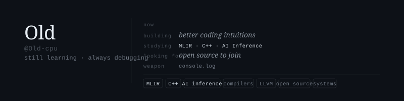

<!--
# Hi there 👋, I'm Old

---

### 💡 About Me

- 🔭 I’m currently working on: **improving my coding skills**
- 🌱 I’m currently learning: **MLIR / C++ / AI Inference**
- 🤔 I’m looking for help with: **open source projects**
- 📫 How to reach me: **open an [issue](https://github.com/Old-cpu/Old-cpu/issues)**
- ⚡ Fun fact: **I love debugging with `console.log` 😄**

---

### 📊 GitHub Status

---
-->

  

 

---

### GitHub Stats

  
  

---

  <code>reach me → open an issue</code>

